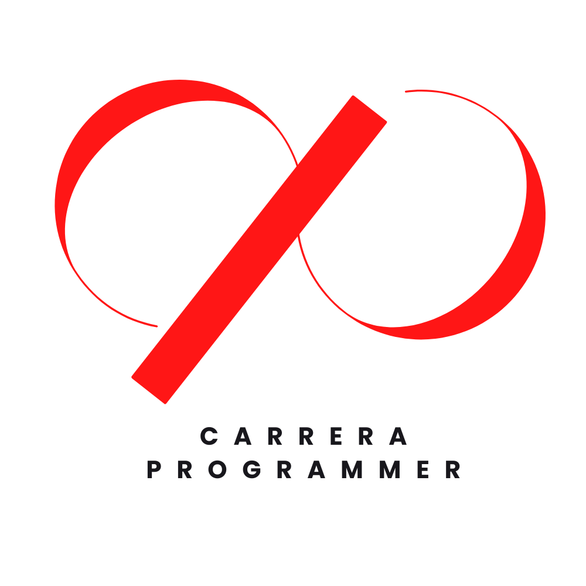

<a name="readme-top"></a>

<div align="center">

  
  <br/>

  <h3><b>Microverse README Template</b></h3>

</div>


# 📗 Table of Contents

- [📖 About the Project](#about-project)
  - [🛠 Built With](#built-with)
    - [Tech Stack](#tech-stack)
    - [Key Features](#key-features)
  - [🚀 Live Demo](#live-demo)
- [💻 Getting Started](#getting-started)
  - [Setup](#setup)
  - [Prerequisites](#prerequisites)
  - [Install](#install)
  - [Usage](#usage)
  - [Run tests](#run-tests)
  - [Deployment](#triangular_flag_on_post-deployment)
- [👥 Authors](#authors)
- [🔭 Future Features](#future-features)
- [🤝 Contributing](#contributing)
- [⭐️ Show your support](#support)
- [🙏 Acknowledgements](#acknowledgements)
- [❓ FAQ](#faq)
- [📝 License](#license)

# 📖 [TO DO LIST] <a name="about-project"></a>


**[TO DO LIST]** is a web-based to-do list application built with JavaScript, HTML, and CSS. With this app, you can create, edit, delete, and rearrange tasks, making it easy to stay organized and on top of your to-do list.

## 🛠 Built With <a name="built-with"></a>

### Tech Stack <a name="tech-stack"></a>

The following technologies were used in the development of this project:

HTML: to structure the content of the page
CSS: to provide visual styling for the page
JavaScript: for DOM manipulation and application functionality
Webpack: to package and compile the JavaScript and CSS files into a single bundle for deployment.


<!-- Features -->

### Key Features <a name="key-features"></a>

> Describe between 1-3 key features of the application.

- **You can add a new task**
- **You can delete a task**
- **You can change the position of the tasks**

<p align="right">(<a href="#readme-top">back to top</a>)</p>


## 🚀 Live Demo <a name="live-demo"></a>


[Live Demo Link](https://carreraprogrammer.github.io/To-do-List/dist)

<p align="right">(<a href="#readme-top">back to top</a>)</p>

<!-- GETTING STARTED -->

## 💻 Getting Started <a name="getting-started"></a>

> Describe how a new developer could make use of your project.

To get a local copy up and running, follow these steps.

### Prerequisites

In order to run this project you need:


```sh
 npm install
```

### Setup

Clone this repository to your desired folder:


```sh
  cd my-folder
  git clone git@github.com:carreraprogrammer/To-do-List.git
``

### Usage

To run the project, execute the following command:

<!--
Example command:

```sh
  npm run build
```
--->

### Deployment

You can deploy this project using:


```sh
    npm start
```


<p align="right">(<a href="#readme-top">back to top</a>)</p>

## 👥 Authors <a name="authors"></a>


👤 **Daniel Carrera**
​
- GitHub: [@carreraprogrammer](https://github.com/carreraprogrammer)
- Twitter: [@carreraprogrammer](https://twitter.com/carreraprog)
- LinkedIn: [Daniel Carrera] (https://www.linkedin.com/in/daniel-carrera-paz-85a917244/)


<p align="right">(<a href="#readme-top">back to top</a>)</p>


<!-- CONTRIBUTING -->

## 🤝 Contributing <a name="contributing"></a>

Contributions, issues, and feature requests are welcome!

Feel free to check the [issues page](https://github.com/carreraprogrammer/To-do-List/issues/).

<p align="right">(<a href="#readme-top">back to top</a>)</p>

<!-- SUPPORT -->

## ⭐️ Show your support <a name="support"></a>

> Write a message to encourage readers to support your project

If you like this project, I'd really appreciate if you can give me a star.

<p align="right">(<a href="#readme-top">back to top</a>)</p>

## 📝 License <a name="license"></a>

This project is [MIT](MIT.md) licensed.

<p align="right">(<a href="#readme-top">back to top</a>)</p>
